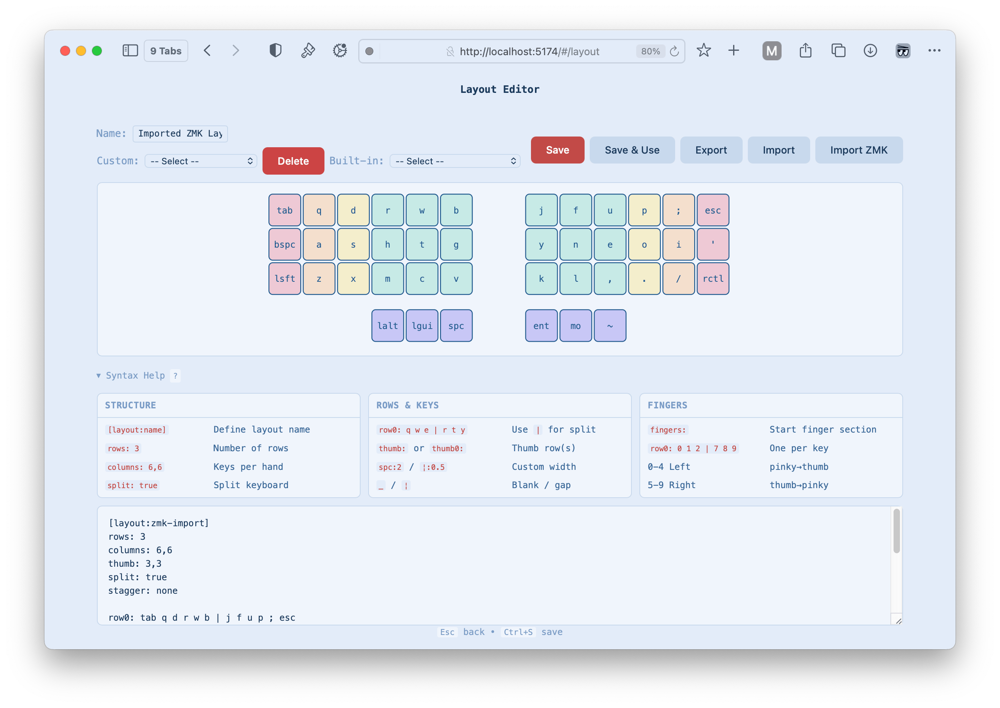
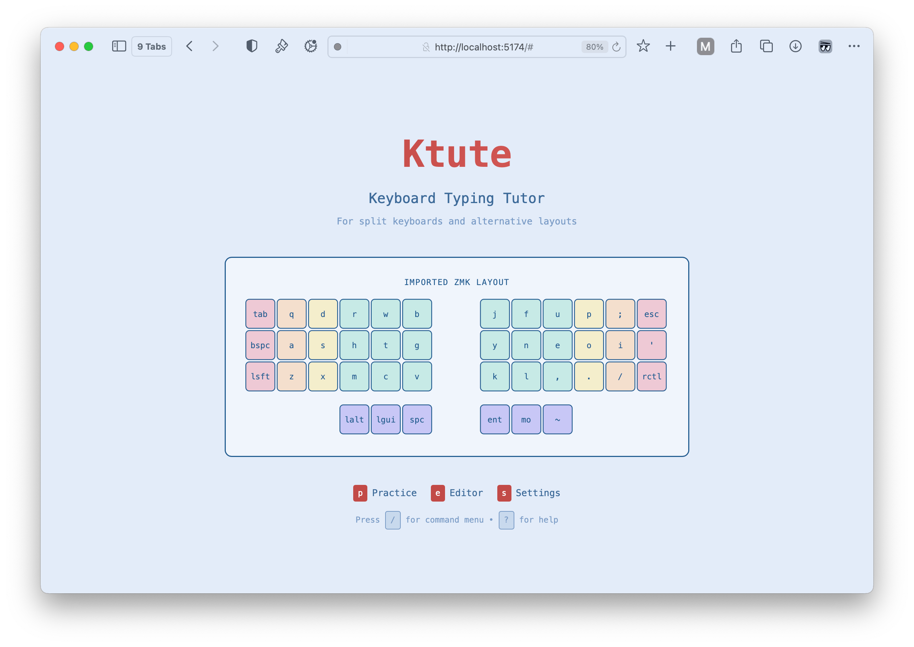
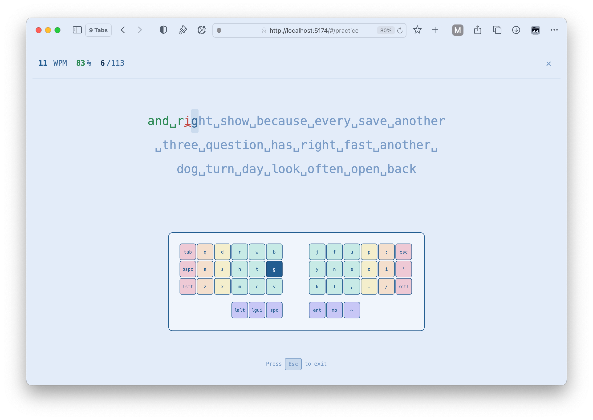
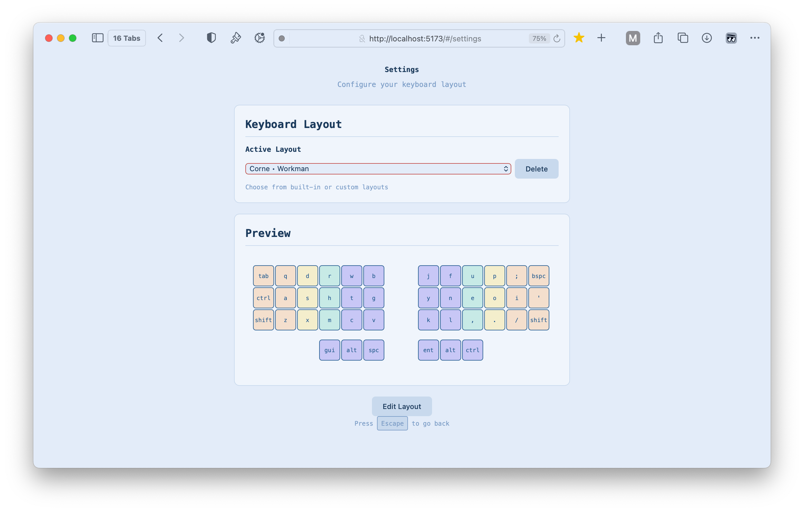
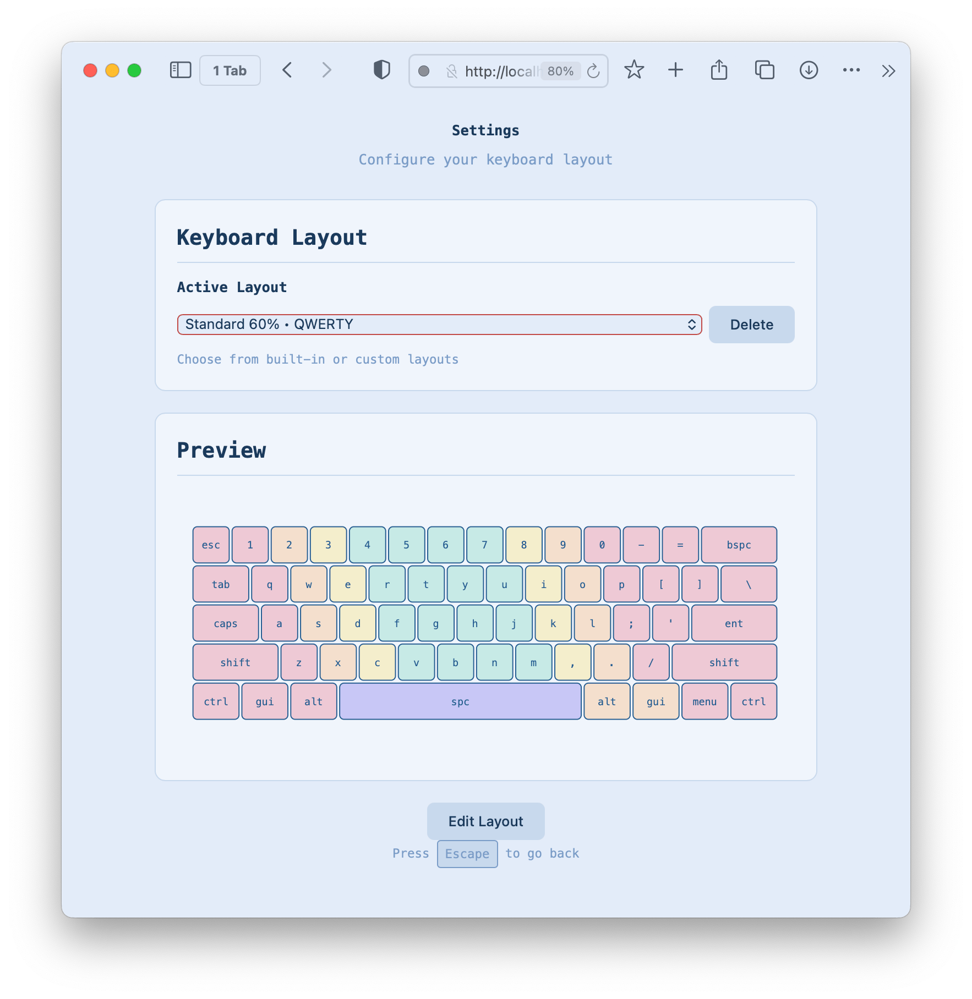
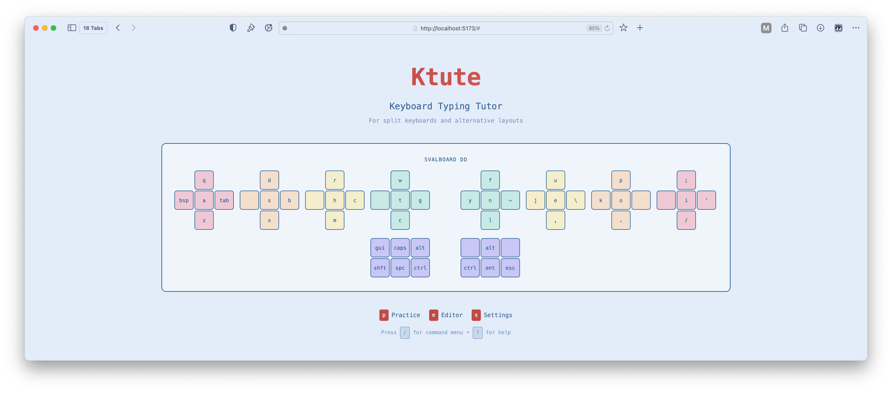

# Ktute - Keyboard Typing Tutor

A keyboard-first typing tutor for split and custom layouts. Everything runs in the browser with no runtime deps beyond the Vite bundle.

## Features
- Keyboard-only navigation with global shortcuts (Escape to back, Ctrl+S to save in editor)
- Custom layout editor with combined physical + logical layout definitions
- Split/ortholinear keyboard rendering with gap and variable-width key support
- Finger highlighting (10-finger scheme, 0-9) and per-key coloring
- Practice view with live stats (WPM, accuracy) and current-key highlighting
- LocalStorage persistence for preferences and custom layouts
- **ZMK keymap import** – paste a ZMK devicetree keymap and auto-generate a Ktute layout with finger assignments
- Toggleable help section in the layout editor for a cleaner workspace

## Imported ZMK Keymaps
Showing that ZMK keymaps can be imported into Ktute's layout editor:

### Layout Editor


### Home View


### Practice View


## Keyboard Layouts

Vaious included keyboard layouts:

#### Corne


#### Standard 60%


#### Ergodox with Settings


## Esoteric Layouts

#### Svalboard + Workman


## Tech Stack
- Vite + vanilla ES modules
- Plain CSS (blueprint-inspired theme)
- SVG keyboard renderer
- Storage via localStorage
- Tests: Vitest (unit) and Playwright (e2e)

## Getting Started
```bash
# install deps
yarn install

# dev server
# opens http://localhost:5173 (port may increment if taken)
yarn dev

# production build
yarn build

# preview built bundle
yarn preview
```

## Testing
```bash
# unit tests
$ yarn vitest run

# or all tests via the package script
$ yarn test --run

# e2e (Playwright)
$ yarn test:e2e   # if a script exists, otherwise run npx playwright test
```

## Layout Definition (combined format)
Header:
- `[layout:name]`
- `rows: N`
- `columns: L,R` (split) or `columns: total` (non-split)
- `thumb: L,R` for thumb counts, or thumb rows `thumb0`, `thumb1`, ...
- `split: true|false`, `stagger: none|standard|columnar`

Rows and keys:
- `row0: q w e r t | y u i o p`
- `thumb: gui alt spc | ent alt ctrl`
- Keys with width: `spc:2`, `shift:1.5`
- Gap: `¦` (1.0) or `¦:0.5` for custom gaps
- Blank physical key: `_`

Fingers (10-finger: 0-4 left, 5-9 right):
- `fingers:` section
- Example: `row0: 0 0 1 2 3 3 | 6 6 7 8 9 9`
- Thumbs: `thumb: 4 4 4 | 5 5 5`

## Keyboard Shortcuts
- Global: Escape (back), Ctrl+S (save in editor), Tab/Shift+Tab (focus nav)
- Practice: Escape (pause/exit), Tab (skip word), Ctrl+Backspace (restart)
- Editor: Ctrl+S (save), Ctrl+N (new), arrow keys to navigate grid

## Project Structure
- `src/` main sources (core, keyboard, engine, views, styles, utils)
- `e2e/` Playwright specs
- `test-results/` test artifacts

## Notes
- If a dev server is already running, `yarn dev` may auto-bump the port.
